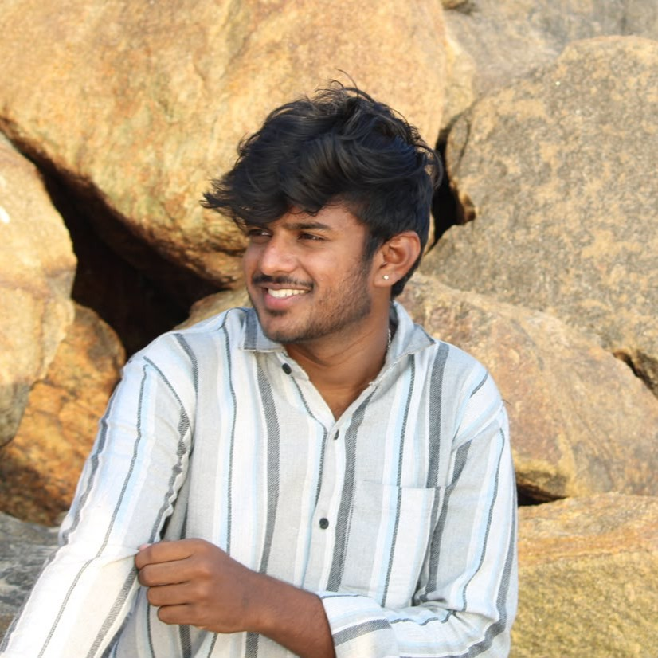

# Soorya S S — Portfolio

### Software Engineer • AI & ML, Automation Enthusiast

###  **"There is No Substitute for Hard Work"**

---

## 🏆 Academic and Project Achievements

▸ **Best Outgoing Student** – Awarded as Best Outgoing Student in the Academic Year 2020–21.

▸ **School 3rd Rank** – Secured School 3rd Rank in 12th Grade.

▸ **1st Prize — Project Expo (2023–24)** – Won 1st Prize in the Project Expo conducted in the academic year 2023–24 by the Department of Computer Science.

▸ **Finalist — iTech Summit Hackathon** – Ranked among the top teams out of 400+ teams.

▸ **1st Prize — Project Expo (2025–26)** – Won 1st Prize in the Project Expo conducted in the academic year 2025–26 by the Department of Computer Science.

▸ **Honored by CSE Association** – Recognized for the successful implementation of the Student Print Web Application.

## 🏅 Leadership and Sports Achievements

▸ **Best Organizing Team** – Organized the PSG iTech Hackathon with 1,700+ participants.

▸ **Sports** – Winners in Cricket (2023–24), Runners-up in Cricket (2024–25), and Winners in Volleyball (2025–26).
